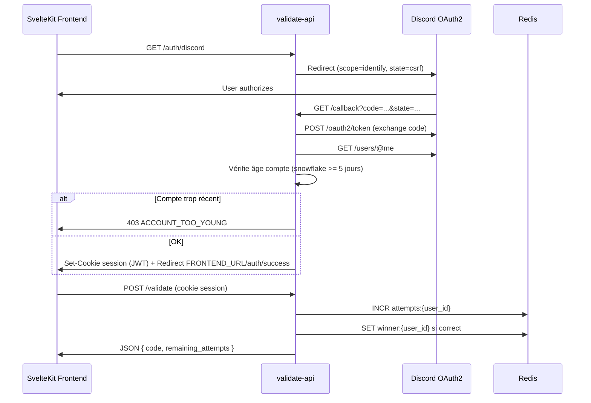

# leveling-validate-api

Micro-service API production-ready pour **Leveling: Unite – The Fragments**.

Authentification Discord OAuth2 + soumission finale de la phrase secrète (15 mots).

## Prérequis

- Go 1.22+
- Docker & Docker Compose
- Compte [Discord Developer Portal](https://discord.com/developers/applications)

## Démarrage rapide

```bash
cp .env.example .env
# Remplir DISCORD_CLIENT_ID, DISCORD_CLIENT_SECRET, JWT_SECRET, SECRET_PHRASE

docker-compose up --build
```

L'API écoute sur `http://localhost:8080`.

Compilation locale :

```bash
go mod tidy
go build ./cmd/server
go test ./...
```

## Configuration Discord OAuth2

1. Créer une application sur [Discord Developer Portal](https://discord.com/developers/applications)
2. **OAuth2 → Redirects** : ajouter `http://localhost:8080/auth/discord/callback` (et l'URL prod)
3. **OAuth2 → Scopes** : `identify` uniquement
4. Copier **Client ID** et **Client Secret** dans `.env`

### Flow OAuth complet



## Variables d'environnement

| Variable | Description |
|----------|-------------|
| `PORT` | Port HTTP (défaut `8080`) |
| `ENV` | `development` ou `production` |
| `REDIS_URL` | URL Redis (`redis://localhost:6379/0`) |
| `DISCORD_CLIENT_ID` | ID application Discord |
| `DISCORD_CLIENT_SECRET` | Secret Discord |
| `DISCORD_REDIRECT_URI` | URI callback OAuth |
| `FRONTEND_URL` | URL SvelteKit (redirect après login) |
| `JWT_SECRET` | Secret HS256 (min. 32 caractères) |
| `SECRET_PHRASE` | Phrase secrète (15 mots) — **jamais en dur dans le code** |
| `ALLOWED_ORIGINS` | Origines CORS séparées par virgule |
| `COOKIE_DOMAIN` | Domaine cookie (`localhost` ou `.ton-domaine.com`) |
| `MAX_ATTEMPTS_PER_DAY` | Max soumissions / 24h (défaut `2`) |
| `MIN_ACCOUNT_AGE_DAYS` | Âge minimum compte Discord (défaut `5`) |
| `RATE_LIMIT_WINDOW_HOURS` | Fenêtre rate limit (défaut `24`) |

## Endpoints

| Méthode | Route | Auth | Description |
|---------|-------|------|-------------|
| GET | `/health` | Non | Santé + statut Redis |
| GET | `/auth/discord` | Non | Redirect OAuth Discord |
| GET | `/auth/discord/callback` | Non | Callback OAuth |
| GET | `/auth/me` | JWT | Profil + `remaining_attempts` |
| POST | `/auth/logout` | JWT | Déconnexion |
| POST | `/validate` | JWT | Soumission phrase |

## Exemples curl

```bash
# Santé
curl http://localhost:8080/health

# Profil (avec cookie session)
curl -b "session=<jwt>" http://localhost:8080/auth/me

# Soumission phrase
curl -X POST http://localhost:8080/validate \
  -H "Content-Type: application/json" \
  -b "session=<jwt>" \
  -d '{"phrase":"mot1 mot2 mot3 ..."}'

# Ou via Bearer token
curl -X POST http://localhost:8080/validate \
  -H "Content-Type: application/json" \
  -H "Authorization: Bearer <jwt>" \
  -d '{"phrase":"mot1 mot2 mot3 ..."}'
```

## Schéma Redis

```
attempts:{discord_user_id}  → entier (INCR), TTL 24h depuis le 1er essai
winner:{discord_user_id}    → "1" permanent (empêche re-soumission)
```

## Intégration frontend (SvelteKit — leveling-unite)

Variable d'environnement front :

```env
PUBLIC_API_URL=http://localhost:8080
```

### 1. Connexion Discord

```html
<a href="{API_URL}/auth/discord">Se connecter avec Discord</a>
```

Redirect direct vers l'API (pas de fetch — navigation browser).

### 2. Page `/auth/success`

Créer une route SvelteKit qui confirme la connexion et redirige vers `/soumettre`.

### 3. Soumission phrase

```typescript
const API_URL = import.meta.env.PUBLIC_API_URL;

async function submitPhrase(phrase: string) {
  const res = await fetch(`${API_URL}/validate`, {
    method: 'POST',
    credentials: 'include',
    headers: { 'Content-Type': 'application/json' },
    body: JSON.stringify({ phrase }),
  });
  return res.json();
}

async function fetchMe() {
  const res = await fetch(`${API_URL}/auth/me`, { credentials: 'include' });
  return res.json();
}
```

### 4. Codes à gérer côté front

| Code | HTTP | Action UI |
|------|------|-----------|
| `VALID` | 200 | Succès — afficher félicitations |
| `INVALID` | 200 | Phrase incorrecte (message générique) |
| `UNAUTHORIZED` | 401 | Rediriger vers login Discord |
| `ACCOUNT_TOO_YOUNG` | 403 | Compte Discord < 5 jours |
| `ALREADY_WON` | 409 | Déjà gagné |
| `RATE_LIMITED` | 429 | Limite 2/jour atteinte |
| `BAD_REQUEST` | 400 | Phrase vide ou trop longue |

### 5. Production — cookies cross-domain

Si front (`leveling-unite.vercel.app`) et API (`api.ton-domaine.com`) sont sur des domaines différents :

- Définir `ENV=production` → cookie session en `SameSite=None; Secure` (automatique)
- `ALLOWED_ORIGINS` doit inclure l'URL exacte du front (`https://leveling-unite.vercel.app`)
- HTTPS obligatoire sur l'API en production
- `COOKIE_DOMAIN` : laisser vide si l'API et le cookie sont sur le même hôte API ; utiliser `.ton-domaine.com` uniquement si front et API partagent un domaine parent
- Les erreurs OAuth redirigent vers `{FRONTEND_URL}/auth/error?code=...` (plus de JSON brut)

## Sécurité

- Phrase secrète **jamais** loggée ni retournée dans les erreurs
- Comparaison constant-time (SHA-256 + `subtle.ConstantTimeCompare`)
- Body `/validate` limité à 2 KB
- Timeout Redis : 2s
- Graceful shutdown SIGINT/SIGTERM
- CORS strict avec `credentials: true`

## Performance & scaling

- Pool Redis configuré (20 connexions, 5 idle)
- Gin en mode `release` en production
- Rate limit 100% Redis (compatible scaling horizontal)
- Handler `/validate` stateless — déployer N instances API derrière un load balancer + Redis partagé

## Éligibilité

**Seule règle d'ancienneté** : compte Discord créé depuis ≥ 5 jours (calculé via snowflake `user.id`).

Aucune vérification d'ancienneté sur le serveur Discord.

## Licence

Propriétaire — Leveling: Unite
